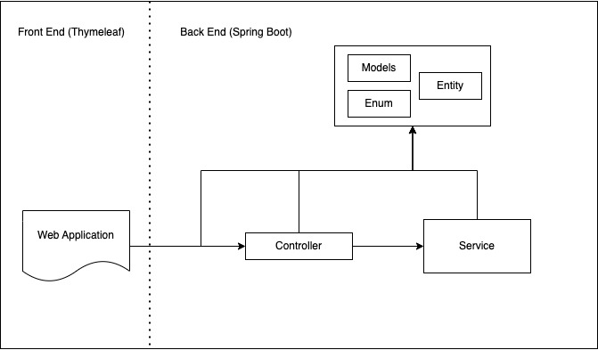

# Tic-Tac-Toe
A simple tic-tac-toe game for 2 player build upon [Spring boot](https://spring.io/) as the backend service and using [thymeleaf](https://www.thymeleaf.org/) for a simple web UI

## Tech stack:
1. [Spring boot](https://spring.io/)
2. [thymeleaf](https://www.thymeleaf.org/)
3. [Java 17](https://docs.oracle.com/en/java/javase/17/)

## How to use:
1. Run the Spring boot application
2. Open http://localhost:8080 on your web browser
3. Play the game!

## Architecture:
